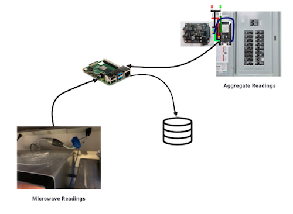

In this project, I build electricity power monitors and additional software to collect our home's power readings.  The next step is to feed the readings into a Deep neural network.  The input to the Deep neural network are a timeseries of power readings.  The output is an estimate of how much electricity (and when) our Microwave was on.
# Why
- I pack up my bags and go on a terrific learning vacation!
  - What is all this AI about?
  - All the software and hardware that must come together to enable this scenario is an intriguing challenge.
- There's been some amount of research into NILM (Non-Intrusive Load Monitoring).  Since I am excited by the prospect if we knew how our elecricity was being used we could save at least 15%, it would be relevant to know how an appliance is using electricity.
- The project holds my interest because of the software and hardware that must come together to enable the scenario.  There is much to learn!

# Input Data
## Existing Datasets
The NILM literature discusses [several available datasets](http://wiki.nilm.eu/datasets.html) to use when exploring aggregate electricity reading disaggregation.  I have experimented with both the REDD and UK-Dale datasets.

## My Data Collection
I decided to collect my own data because it gives me complete insight to everything that goes into how sensor get readings from breaker boxes and plugs to how data is cleaned and used within a Jupyter notebook.  It allowed me the flexibility to define what features to collect, when, and what.

I chose a sampling rate of 1 second because:
- I want samples taken with the shortest amount of time between readings.
- There is a > 98% chance the system can record the samples within this time period.
### Feature Extraction
The Features that I will use in the model include:
- __Aggregate power readings__ come from [a FitHome monitor at the breaker box](https://github.com/BitKnitting/FitHome/wiki/ElectricityMonitor).  I have slightly modified the monitor's firmware for this project.
- __Aggregate reactive power readings__ As pointed out [in this article](https://www.elprocus.com/importance-of-reactive-power-in-power-system-network/), _Transformers, motors, generators and other electrical devices require reactive power to produce magnetic flux._ Devices like hair dryers, lamps, heaters - those things that use all the power don't need reactive power.  By including reactive power as a feature, devices can be included or eliminated based on the amount of reactive power they require.
- __Hour of the day__: Many appliances - like the microwave - are typically used at the same time each day.  By using this feature, I am expecting the modeling will be better.  
  
I will not send current and voltage readings because active power as a [feature extraction](https://en.wikipedia.org/wiki/Feature_extraction) of current and voltage because P = IV.

### Target Data
The target data are the active power and current readings from the electricity monitor hooked up to the microwave.  The monitor I'm using on the microwave is a Smart Plug.  Post capture, I can take these readings and determine when the microwave was on or off.  I can then convert these two columns (active power and current) into a category column in which 1 = microwave is on and 0 = microwave is off.

# Monitor Code
__TODO: SystemD services__

Two monitors will be used:
-  One at the breaker box to capture aggregate active and reactive power.  I am modifying the code I use for the [FitHome monitor](https://github.com/BitKnitting/FitHome/wiki/ElectricityMonitor) to work with this project.  The code is in this GitHub repository.
- A [TP-LINK HS110](https://github.com/BitKnitting/FitHome/wiki/PlugE) 
One at the microwave that will send a 1 when the microwave is on, a 0 when it is off.  I call the software I wrote [PlugE](https://github.com/BitKnitting/FitHome/wiki/PlugE) to reflect the code "goo" needed to get readings from the HS110 and figure out if the microwave is on or off.
## Send Readings  
The two monitors independently send readings.  These are put in the mongodb database running on the Rasp Pi.  Both are within the FitHome DB.  The aggregate data is in the aggregate collection.  The microwave data is in the microwave collection.
# Data Pipeline
## MongoDB to Zip files
The first step in the data pipeline is to get the aggregate and microwave readings out of mongodb and into two Pandas dataframes that are then compressed into Zip file.  
  
The [mongo_to_pandas script](https://github.com/BitKnitting/FitHome_mongodb/blob/master/data_results/mongo_to_pandas) takes in the database, collection names of the data in the mongo db as well as an output name for the file and:
- Exports readings in the collection into a .json file.
- Takes the .json file and pickles it using the [json_to_pickle.py](https://github.com/BitKnitting/FitHome_mongodb/blob/master/data_results/json_to_pickle.py) Python script.
- Zips the pickled file into the <filename>.pkl.zip filename.

Run within the mongodb project using the command: `$ . mongo_to_pandas`

